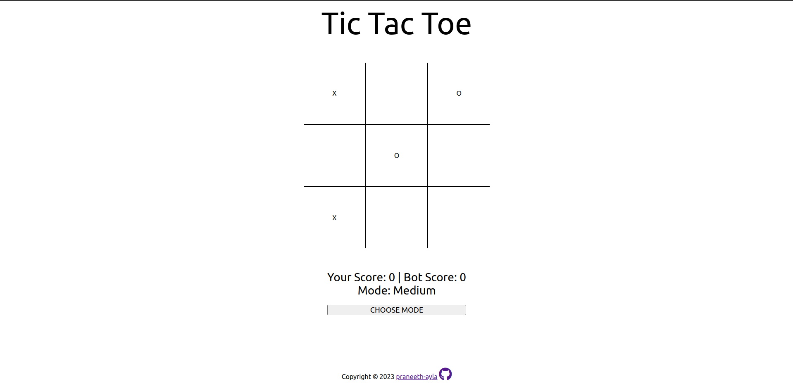

# Tic-Tac-Toe Game

[Live Demo](https://praneeth-ayla.github.io/tic-tac-toe/) | [The Odin Project](https://www.theodinproject.com)

## Description

A web-based implementation of the classic Tic-Tac-Toe game with a single-player mode. The game features an adjustable difficulty level for the AI opponent, which utilizes the minimax algorithm for optimal moves.



## Features

- Single-player mode with adjustable difficulty levels.
- Minimax algorithm for the AI opponent.
- Simple and intuitive user interface.

## AI Implementation

The game features a simple yet effective artificial intelligence (AI) system based on the minimax algorithm, providing a challenging experience in the single-player mode.


## How to Play

- **Clone the repository:**

   ```bash
   git clone https://github.com/your-username/tic-tac-toe-game.git
   cd tic-tac-toe-game

- **Open the Game:**

   Open the `index.html` file in your web browser or deploy the game on a live server.

-  **Single-Player Mode:**

    Choose the desired difficulty level before starting the game.

-  **Make Your Moves:**

    Click on the cells of the game board to make your move.

- **Single-Player Mode:**

    If playing against the bot, select the desired difficulty level before starting the game.

- **Enjoy Playing:**

    Have fun playing Tic-Tac-Toe!


## Minimax Algorithm in Impossible Mode

In the "Impossible" mode of this Tic-Tac-Toe game, the artificial intelligence (AI) opponent employs the minimax algorithm to make optimal moves. The minimax algorithm is a decision-making algorithm used in two-player games, such as Tic-Tac-Toe.

### How Minimax Works

1. **Maximize the Score for the AI (Maximizer):** The AI player aims to choose the move with the maximum score, assuming the opponent plays optimally.

2. **Minimize the Score for the Player (Minimizer):** The algorithm assumes that the player will make the best move possible, attempting to minimize the AI's score.

3. **Recursion:** The algorithm recursively explores possible moves on the game board, creating a tree of possible outcomes. It assigns scores to each possible move based on the final game state.


## Technologies Used

- HTML
- CSS
- JavaScript


## Acknowledgments

This project is part of The Odin Project's curriculum, providing hands-on experience in web development. Explore more projects on [GitHub](https://github.com/praneeth-ayla).

**Note:** Your feedback and contributions are valuable. Feel free to enhance the project and share your insights!
